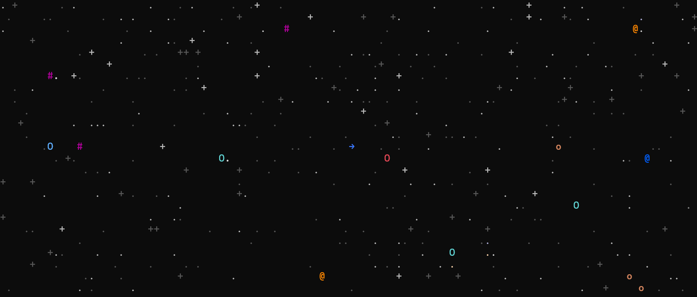
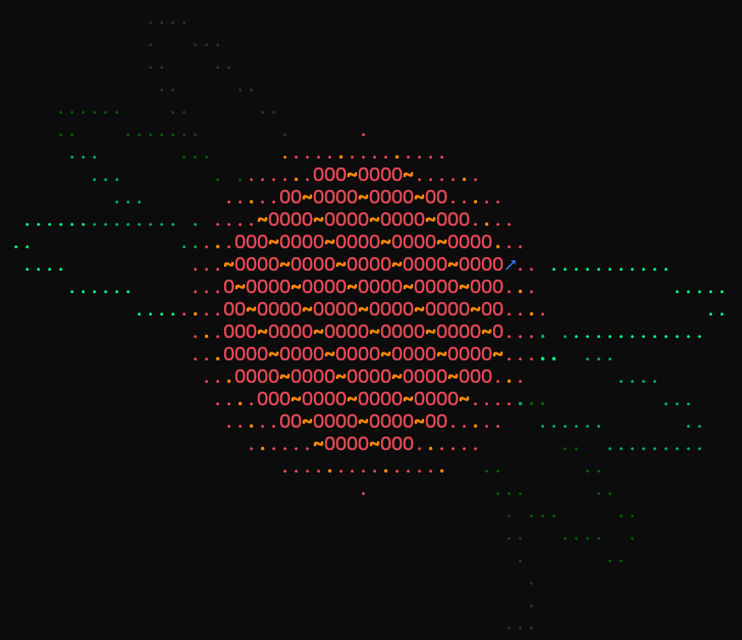
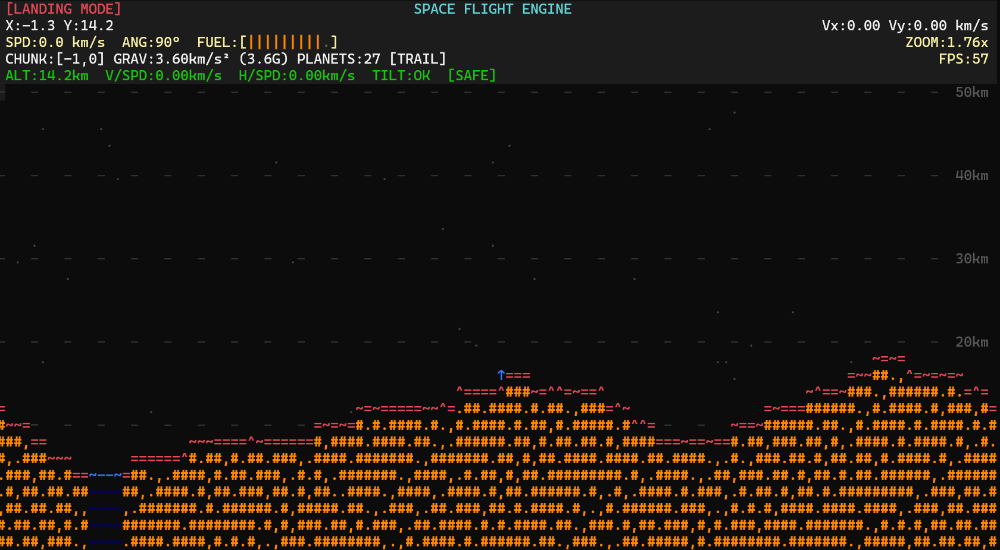

# Terminal Space Flight Engine





A high-performance, purely terminal-based 2D space flight simulator and physics engine written entirely in C++20 from scratch. This project features a procedurally generated infinite universe, realistic orbital mechanics, and a custom raw-mode terminal renderer capable of running smoothly at 60 FPS without any external graphical libraries (no SDL, OpenGL, or Raylib).

The engine is designed as a foundational playground for realistic Newtonian space flight and is architected to eventually serve as a headless Gym-style environment for Reinforcement Learning (RL) agents.

## Features

* **Infinite Procedural Universe:** A chunk-based generation system spawns an endless expanse of star systems, nebulae, and singularities. Planets are generated based on true 3D volumetric density, ensuring realistic mass distributions and visual properties.
* **Rich Terminal Rendering:** A custom double-buffered terminal renderer utilizes 256-color ANSI escape codes, Unicode glyphs, and dynamic spatial mapping to render planetary surfaces, 3D-perspective planetary rings, moons, and background starfields.
* **Rigorous Orbital Mechanics:** The simulation utilizes a Semi-implicit Euler integration scheme to perfectly conserve orbital energy. Gravity adheres to the inverse-square law ($1/r^2$) outside planetary bodies and follows the shell theorem inside them, creating flawless singularity-free slingshot maneuvers.
* **Realistic Spacecraft Physics:** True to Newtonian physics (Newton's 1st Law), there is no artificial friction or drag in space. Your spacecraft maintains its momentum indefinitely. Maneuvering requires precise application of prograde and retrograde thrust.
* **Dynamic Camera System:** A robust viewport system capable of massive multi-scale zooms (from 10x down to 0.01x), dynamically expanding chunk-loading radii up to spans of 22,000+ km without visual popping.
* **Planetary Landing Simulation:** Seamlessly transition from orbit to a high-fidelity 2D landing minigame featuring procedural terrain, cliffs, and level water bodies (landing in water, too fast, or in wrong orientation will result in a crash).
* **Singularities & Wormholes:** Encounter procedurally generated black holes with swirling accretion disks that function as navigational wormholes across the infinite map.
* **Advanced Resource Management:** A strategic propulsion system governed by a multi-stage fuel gauge, replenished only by successful landings or system resets.

## Requirements

* **OS:** POSIX-compliant system (Linux / macOS / WSL)
* **Compiler:** `g++` (or `clang++`) with C++20 support
* **Terminal:** A terminal emulator that supports raw mode, UTF-8, and 256-color ANSI escape sequences.

## Build and Run

The project uses a standard Makefile for compilation. No external dependencies are required.

```bash
# Clone or navigate to the project directory
cd planets

# Compile the engine
make

# Run the simulator
./planets
```

## Controls

| Key | Action |
| :--- | :--- |
| `W` / `↑` | **Thrust (Prograde):** Fire main engines in the direction you are facing. |
| `S` / `↓` | **Thrust (Retrograde):** Automatically thrust opposite to your current velocity vector to brake. |
| `A` / `←` | **Rotate Left:** Rotate the spacecraft counter-clockwise. |
| `D` / `→` | **Rotate Right:** Rotate the spacecraft clockwise. |
| `Q` / `E` | **Thrust + Turn:** Fire engines while simultaneously turning. |
| `Z` / `C` | **Brake + Turn:** Retrograde braking while simultaneously turning. |
| `L` | **Land:** Initiate landing sequence when in proximity to a planet. |
| `R` | **Retry / Respawn:** Reset the ship after a crash or fuel exhaustion. |
| `SPACE` | **Emergency Stop:** Instantly zero-out all velocity (debug/cheat). |
| `T` | **Toggle Trail:** Show/hide the spacecraft's historical orbital trajectory. |
| `X` | **Clear Trail:** Erase the current trajectory trail. |
| `+` / `=` | **Zoom In:** Scale the camera view closer to the ship. |
| `-` / `_` | **Zoom Out:** Scale the camera view out to visualize the solar system. |
| `ESC` / `Ctrl+C`| **Quit:** Exit the simulator. |

## Technical Architecture

* **Renderer (`src/renderer.*`):** A custom frame buffer that parses world coordinates into discrete terminal cells, handling Z-indexing (drawing planets over rings, etc.) and optimizing output streams to prevent terminal tearing.
* **Physics (`src/physics.*`):** Handles $O(n^2)$ independent gravity calculations between the ship and all loaded celestial bodies, including singularity-capped surface gravity for landing zones.
* **Chunk Manager (`src/chunk.*`):** Dynamically scales chunk loading based on the camera's zoom level. Uses deterministic hashing to ensure the procedural universe remains persistent as you fly back and forth.

## Roadmap

1. **Spatial Partitioning (Quadtrees):** Optimize collision and gravity calculations for massively dense star clusters.
2. **Headless RL API Integration:** Expose the engine state matrix via a decoupled API so the simulation can be stepped artificially fast, allowing an AI agent to learn how to achieve stable orbits.
3. **Orbital Visualizations:** Real-time mathematical prediction of Apoapsis and Periapsis lines.


